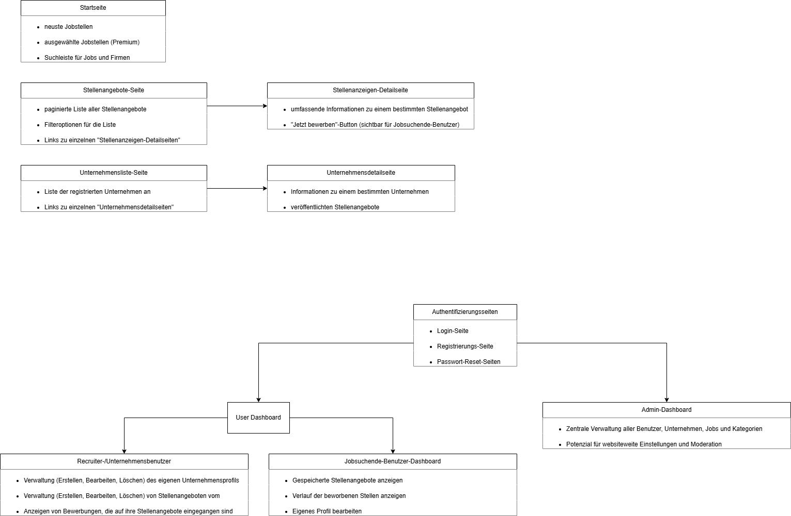

Wir entwickeln eine browserbasierte Anwendung zur Verwaltung von Stellenanzeigen. Diese Anwendung bietet eine Vielzahl von Funktionen, um die Verwaltung von Stellenanzeigen effizient und benutzerfreundlich zu gestalten.

## Vorbereitungen
Erstellen Sie ein GIT-Projekt und committen Sie die Schritte einzeln. Alle Projektdateien sollten im Repository enthalten sein.
Aufgaben

## Aufgabe 1 - Konzept

Visualisieren Sie den Aufbau Ihrer Anwendung mit einer einfachen Skizze. Ihre Darstellung sollte die folgenden Informationen enthalten:

- Sitemap: Welche Seiten hat die Anwendung?
- Modelle: Welche Modelle gibt es und welche Attribute/Datenbankspalten haben diese?
- Beziehungen: Welche Beziehungen haben die Modelle zueinander?
- Benutzerrechte: Welche Rechte haben User?

Sitemap

ER-Modell

## Aufgabe 2 - Installation
Setzen Sie eine saubere Installation mit Laravel auf. Halten Sie sich an die Laravel-Dokumentation.

**Ziel: Aufrufen der “Hello World” Seite.**

## Aufgabe 3 - Modelle und Controller
Erstellen Sie alle Modelle zusammen mit den dazugehörigen Controllern, Migrations, Policies und Co.

**Tipp: Nutzen Sie das Terminal: sail artisan make:model Job --all**
Füllen Sie die angelegten Dateien mit Inhalten, insbesondere die Migrations und die korrekten Datenbankspalten.

## Aufgabe 4 - Ansichten

Erstellen Sie zu jedem Modell:

Eine Listenansicht
Eine Detailansicht
Eine Erstellungs-/Bearbeitungsansicht
Verknüpfen Sie die Ansichten mit den Controllern.

**Ziel: Alle Ansichten sind mit den Controllern verknüpft und zeigen die gewünschten Datenbankinhalte an bzw. erlauben die Bearbeitung.**

## Optionale Aufgaben

- Verknüpfen Sie die Policies mit den Controllern.
- Fügen Sie Ihrer Anwendung Unit Tests hinzu.
- Integrieren Sie in eins Ihrer Formulare einen Bilderupload.
- Nutzen Sie den Cache für einige Abfragen.
- Integrieren Sie dynamische Breadcrumbs.

Überlegen Sie sich eigene Features.
